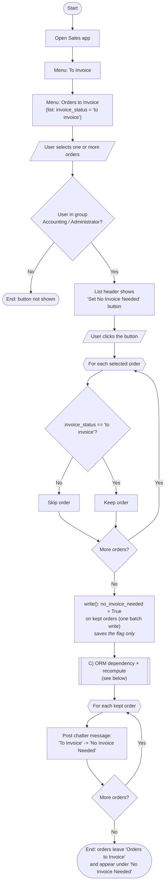
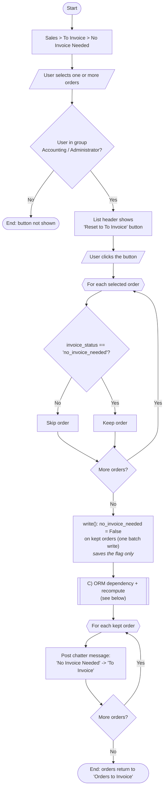
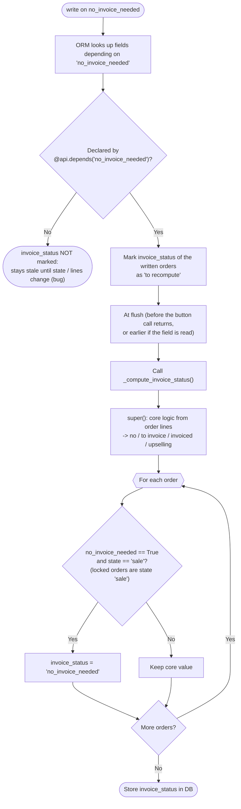

# Sale Extension - No Invoice Needed: algorithm

The buttons never write `invoice_status` directly. They write only the flag `no_invoice_needed`;
the ORM then recomputes `invoice_status` through `@api.depends` (sub-process **C**, shared by A and B).

## A) To Invoice -> No Invoice Needed  (`action_set_no_invoice_needed`)

## B) No Invoice Needed -> To Invoice  (`action_reset_to_invoice`)

## C) ORM dependency + recompute (triggered by the write in A or B)

Note on timing: C is lazy. In A/B it is drawn right after the write for clarity; in practice the
ORM may run it while the chatter loop runs or at the final flush, but always before the button's
transaction commits, so the stored status is correct when the list reloads.
